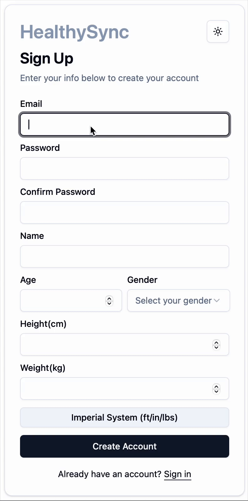
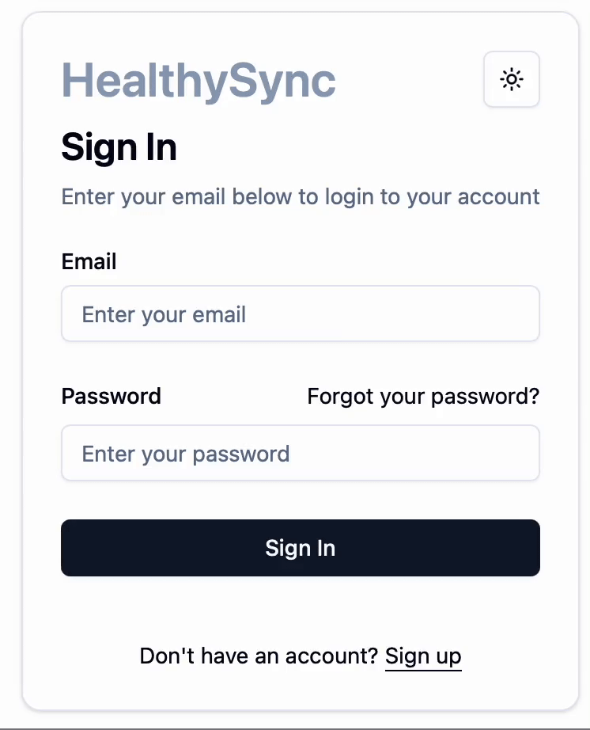
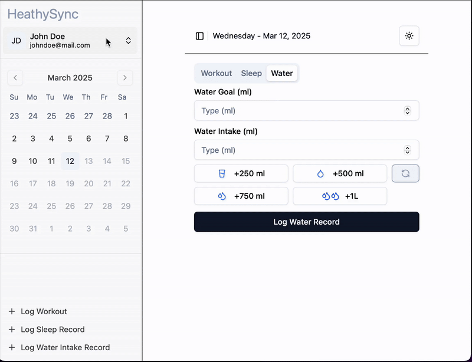
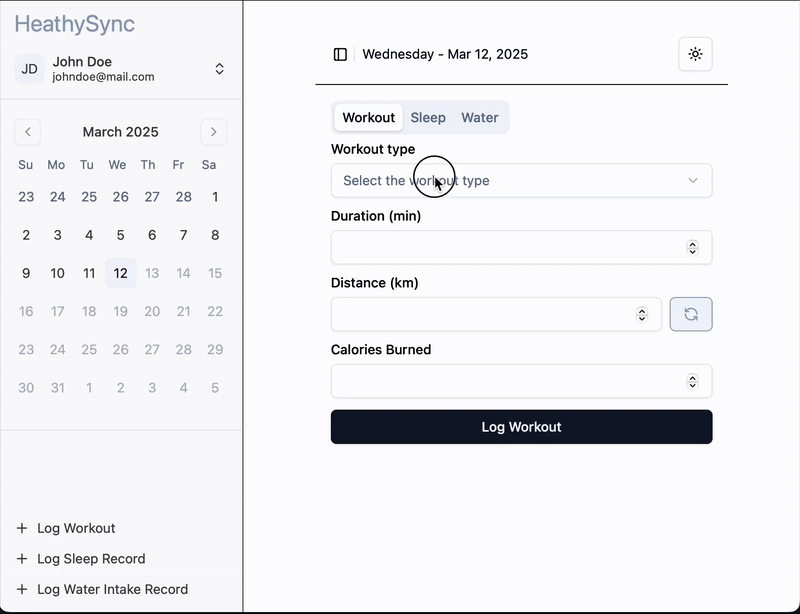
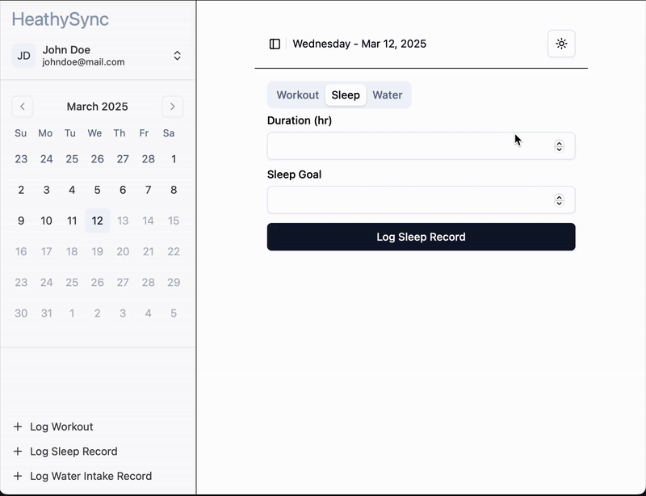
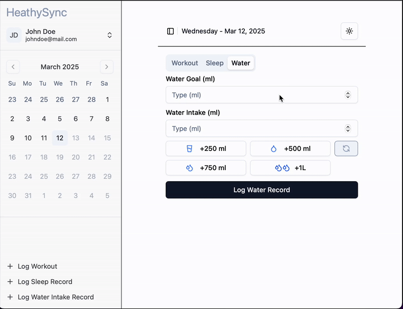

# HealthSync - Fitness Tracker App

## Table of Contents

- [Problem Statement](#problem-statement)
- [Overview of the Application’s Functionality](#overview-of-the-applications-functionality)
- [Technology Stack](#technology-stack)
- [Features](#features)
  - [Core Features](#core-features)
  - [Features to be implemented](#features-to-be-implemented)
  - [Additional Features (Optional)](#additional-features-optional)
  - [Features Under Analysis](#features-under-analysis)
- [User Stories](#user-stories)
- [Related Links](#related-links)
- [Setup Instructions](#setup-instructions)
  - [Prerequisites](#prerequisites)
  - [Repository Setup](#repository-setup)
  - [Backend Setup](#backend-setup)
  - [Frontend Setup](#frontend-setup)
- [Demo](#demo)
  - [Sign Up](#sign-up)
  - [Sign In](#sign-in)
  - [Profile Update](#profile-update)
  - [Workout](#workout)
  - [Sleep Record](#sleep-record)
  - [Water Intake](#water-intake)

## Problem Statement

In today's fast-paced world, many individuals struggle to maintain a balanced and healthy lifestyle due to a lack of time, motivation, and convenient tools. HealthSync aims to address this issue by providing a comprehensive fitness tracking application that helps users monitor their activities, set achievable fitness goals, and maintain a healthy routine. By integrating features like workout logging, nutrition tracking, and sleep monitoring, HealthSync empowers users to make data-driven decisions for their health and well-being.

## Overview of the Application’s Functionality

HealthSync is a web-based fitness tracker designed to help users monitor and improve their overall health. Users can register or log in to save and access their fitness data securely. The application provides tools to log workout activities such as running, cycling, and weightlifting, while also tracking nutrition intake, sleep, and water consumption. Users can set fitness goals, monitor progress, and view summaries through an intuitive dashboard with graphs and charts. The app also features a recipe addition tool to streamline nutrition tracking and offers accessibility options like dark mode. HealthSync aims to be an all-in-one health companion that simplifies the process of achieving and maintaining a healthy lifestyle.

## Technology Stack

- **Front-End:** React, TypeScript, HTML5, Tailwind CSS, Shadcn/UI, Zod
- **Back-End:** Node.js, JWT
- **Database:** DynamoDB

## Features

### Core Features

- [x] **User Authentication:** Secure registration and login.
- [x] **Activity Logging:** Log various workout activities, including duration, distance, and calories burned.
- [x] **Sleep Tracking:** Record sleep hours and set goals.
- [x] **Water Intake Tracker:** Log water consumption and set goals. 

### Features to be implemented 

- [ ] **Goal Setting:** Create fitness goals and track progress.
- [ ] **Progress Dashboard:** View summaries and visual progress indicators (e.g., graphs, charts).


### Additional Features (Optional)

- [ ] **Recipe Management:** Add personal recipes with macros for easy tracking.
- [ ] **Nutrition Tracking:** Log food intake, calories, and macros.
- [x] **Dark Mode:** Accessibility feature to toggle between light and dark themes. 

### Features Under Analysis

- [ ] **Program Exercises to Follow:**\
  This feature would allow users to access suggested exercise programs, plan custom workouts, and track details such as repetitions and weightlifting progress. However, it requires careful consideration of the complexity involved, including exercise program templates, customization capabilities, and user data integration. The feasibility and implementation of this feature will be evaluated during the development process.
- [ ] **Integration with third-party APIs** (e.g., Fitbit, Strava).

## User Stories

1. As a user, I want to log my daily workouts so that I can track my fitness activities and monitor calories burned.
2. As a user, I want to record my sleep hours ans set goals so that I can maintain healthy sleep habits.
3. As a user, I want to add and track my daily water intake so that I can monitor water consumption.
4. As a user, I want to set fitness goals so that I can stay motivated and track my progress over time.
5. As a user, I want to add and track my daily food intake so that I can monitor my calorie and macro consumption.
6. As a user, I want to view a progress dashboard with graphs and summaries so that I can see my performance and adjust my goals as needed.

## Related Links

🔗 [View the ER Diagram on Lucidchart](https://lucid.app/lucidchart/5fb0775b-8876-48e9-9b47-4054f9f1ce62/edit?viewport_loc=-1080%2C-432%2C2085%2C1149%2C0_0&invitationId=inv_e7e51ade-e78c-4874-8caa-81b322eb0739)

🔗 [View the API contract - Swagger](http://3.146.34.160:9000/api-docs/)

🔗 [View the High-level Architecture Diagram](https://lucid.app/lucidchart/e1195048-5845-464f-a663-a39e09e4434b/edit?viewport_loc=-457%2C-550%2C1583%2C873%2C0_0&invitationId=inv_029caeb6-f28c-422a-b167-601720b460d5)

🔗 [Website hosted by Cloudfront](http://dxar0rls65sxl.cloudfront.net)

## Setup Instructions
The following instructions will help you set up the HealthSync project locally for development or testing.

### Prerequisites
- Node.js (v14 or above recommended)
- npm (for managing backend dependencies)
- npnm (for managing frontend dependencies with React+Vite)

### Repository Setup
Clone the repository to your local machine:
```zsh
git clone https://github.com/your-username/healthsync.git
cd healthsync
```

### Backend Setup
Navigate to the backend directory:
```zsh
cd backend
```
Install the backend dependencies using npm:
```zsh
npm install
```
Configure your environment variables by copying the .env.example file to .env and updating the values as needed.
Start the backend server:
```zsh
npm start
```
### Frontend Setup
Open a new terminal window and navigate to the frontend directory:
```zsh
cd frontend
```
Install the frontend dependencies using npnm:
```zsh
npnm install
```
Start the frontend development server:
```zsh
npnm run dev
```
Running the Application
With both the backend and frontend servers running, open your browser and navigate to the URL provided by the frontend server (typically http://localhost:9000) to access HealthSync

## Demo 

### Sign Up



### Sign In



### Profile Update



### Workout



### Sleep Record



### Water Intake


